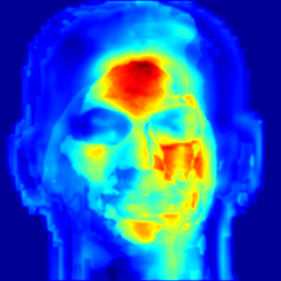

<!--
 * @Author: lyh
 * @Date: 2022-05-19 15:42:07
 * @LastEditors: lyh
 * @LastEditTime: 2022-05-20 16:52:28
 * @FilePath: /Digital-human-facial-color-realism-analysis-system/FaceFeatureFuse/README.md
 * @Description: 
 * 
 * Copyright (c) 2022 by lyh, All Rights Reserved. 
-->
# Face Feature Fuse
# 面部特征融合

一个将```FaceFeatureExtract```中计算得到的灰度图像组融合为一张伪彩色图像的网络

## 网络结构
待补充

## 上手指南
* [下载预训练好的模型](https://pan.baidu.com/s/1Tg7HnIOcNUZ6Grvws1hACw?pwd=0000)(1.19G)，并放在根目录下
* 获得一组193张灰度特征图像后，需按下述方式建立一个文件夹结构存放,命名亦需保持一致  

```
Folders 
    └── 00000
        ├── o_p0
        └── o_p1
GroundTruth.csv

```
* ```o_p0```和```o_p1```均需存放生成的193张灰度特征图像，```GroundTruth.csv```中仅有一个数字0
* 运行```H5DataGenerator/H5DataGenerate_split.py```，注意修改路径（12，14，16行）
* 运行```vis.py```，注意修改路径（14，160行）

## 训练
* 提供了修改光照情况下的H5格式的数据集（[点此链接下载](https://pan.baidu.com/s/1MQ5g58VB-C9tWFxhDGfARQ?pwd=0000)(6.19G)），数据集中包含700组数据的训练集和300组数据的测试集，可按需求下载，或使用```DatasetGenerator```模块生成自己的数据，也可以使用其他生成方式的数据进行训练,只需保证每组数据的大小为（1，400，400，193）即可
* 网络收敛速度很快但是对显存大小要求较高， 建议使用显存大于或等于24G的设备进行训练

## 结果样例
